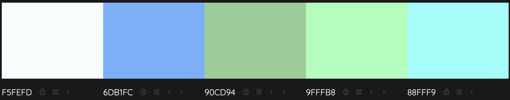

# NutriForce B2C Online Shop
NutriForce is a B2C online shop for sports and health nutrition in Ireland. The main purpose of the site is to enable the developer's friend to set up shop, as has been planned over a longer period of time. The reason for this is so that customers in Ireland can have a small, local business to support when it comes to their nutritional needs. High quality products will be sourced to build a loyal customer-base that trusts in the shop. A long-standing dream will come to fruition with the launch of this online shop, and we hope to provide customers with all the sports and health nutrition they need, as well as personalised, and excellent customer service. This can be become the one-stop-shop for anyone regularly purchasing such products, as requests will also be accepted, where we will aim to source the items, wherever possible. Welcome to the NutriForce family! Thank you for helping to make this dream possible!

1. [User Experience](#user-experience)
   
## Web Marketing - TO BE UPDATED
### Target Audience
The target audience is any adult interested in sports, and/or their health within Ireland. Whether they are just starting out, or experienced with their nutrition, NutriForce can help with suggestions, recommendations, or even sourcing a customer's favourite products, if not already in stock on the site.

The shop only has an online presence, but ensures to let customers know that it's a small, local business, using the keywords on the site, as well as the information on the About Us page. With shopping local becoming increasingly important worldwide, it's imperative the target audience is made aware of who they are buying their nutritional products from. Due to the planned scale of the business, the shop only allows addresses in Ireland for orders.

Pricing for products on the site will be competitive, as there are many large companies selling such items. While a slight increase to big box store prices is typically acceptable for customers interested in shopping locally, if the prices are too high, the benefits of using a small business will not be enough to attract and keep customers.

### Newsletter
A newsletter signup link is available on every page of the site. The prominent but unobtrusive display of this feature makes it easy for customers to make use of it, without being bothered by it. When a user signs up, a confirmation email is sent out to the email address used. This helps to ensure no one's email is used or stored for this, without their consent (in case someone uses an email address that does not belong to them). The confirmation email includes a link to unsubscribe from the mailing list that can be used at any time. If the email address used is linked to a registered account, the user can also unsubscribe from their Profile at any time as well.

Privacy and customer experience concerns aside, the newsletter is used to promote special deals and new products, which should help entice some customers to make additional purchases.

### Facebook page
A social media presence is critical for any business in current times. A mock-up Facebook page was created for the business that can be viewed below. [An actual business page already exists](https://www.facebook.com/profile.php?id=100094712224458), created by the business owner, but has not been used for this project. It is also not yet complete.

### SEO
Including site metadata and keywords, robots.txt and sitemap.xml

### Informational Pages
Additional pages - all in the site footer - were created to ensure customers have all the necessary information about the company, their data and it's usage, and orders. Everything below in this section will help show customers that this is a trusted site they can make purchases from, as we are transparent, and all information is readily available. The Shipping, Returns, and Privacy pages additionally include details on how to get in touch with the support team, should the customers need this.

#### About
This page gives an introduction about the company and what is important to us. It should help customers feel more connected to us, and hopefully instill some confidence, as our values greatly relate to quality and integrity, as stated on the page.

#### Shipping
The Shipping detail page is currently rather generic, but will be updated once the shop officially goes live. For now, basic information is available to customers on the free shipping limit, shipping methods and times, and delayed orders.

#### Returns
This page details information on returns and refunds, again so customers don't have to search for this and have it readily available. The page ensures customers don't need to search for information necessary for them to know according to their rights, when a refund or return is required.

#### Privacy Policy
Details regarding what data is collected from customers and how it is used is fully outlined on this page. This is critical, particularly with the site being not only available in the EU, but specifically selling in Ireland (EU).

#### Terms & Conditions
A page outlining the full T&C for the site is available.

## User Experience

### Visitor Goals

#### First-Time Visitor Goals
- As a first-time visitor to the site, I can make purchases to buy health and sports nutrition products that I need.
- As a first-time visitor to the site, I can sort, search, and view products, and see if those are in stock.
- As a first-time visitor to the site, I can view any necessary regulatory information about the site, such as details on shipping, returns, and the privacy policy.

#### Returning Visitor Goals 
- As a returning visitor to the site, I can create an account to save my details for an easier checkout experience.
- As a returning visitor to the site, I can view my purchased orders and their details in my account.
- As a returning visitor to the site, I can make purchases, while logged in, that are automatically linked to my account.

#### Frequent Visitor Goals 
- As a frequent visitor to the site, I can update my account details (addresses, email address, password) so they stay up-to-date.
- As a frequent visitor to the site, I can delete my account, so I am in charge of my data.
- _As a frequent visitor to the site, I can save items for later, so I can keep track of them, when I don't want to immediately purchase them*_
- _As a frequent visitor to the site, I can add out-of-stock items to a watchlist, so I can see and get notified when they are back in stock*_

_* Save for Later and Watchlist features are not yet implemented. This is planned for release 1.1_

### User Stories
All EPICs and related user stories are listed in the [repository Issues here](https://github.com/crazycooky77/ci_project5/issues?q=is%3Aissue+is%3Aclosed+label%3Auser-story%2CEPIC).

### Design

#### Colour Palette

#### Typography
The [Montserrat Google font](https://fonts.google.com/specimen/Montserrat) is used throughout the site.

#### Imagery
[Bing AI](https://www.bing.com/images/create) was used to create the logo, default product, and favicon images on the site. It was also used for the banner and "liked by" profile images in the Facebook page mockup.

### Site Planning

#### Entity-Relationship Diagram

#### Wireframes
Wireframes were used to plan out the pages for the site. Minor adjustments were made throughout, as the pages were being created. The navigation menu was reorganised in the final site iteration, and differs from the wireframes below as follows:
1. The Newsletter Signup option was added next to the Support Contact details
2. The site logo and user action buttons (view cart, log in, create account) have swapped sides
3. The user action buttons all have icons added (instead of only the Cart button)

##### <ins>Login / Create Account</ins>
**Login:**
_Social media signup options have not yet been implemented. This is planned for release 1.1. [See user story here](https://github.com/crazycooky77/ci_project5/issues/20#issue-2248986787)._

**Create Account:**
_Social media signup options have not yet been implemented. This is planned for release 1.1. [See user story here](https://github.com/crazycooky77/ci_project5/issues/20#issue-2248986787)._

#### <ins>Profile Pages</ins>
**Account Details:**

**Addresses:**
_The Add New Address (now Add Address) button was moved, but otherwise the style has stayed the same._

**Orders:**

**Order Details:**

**Saved Items:**
_Saved Items have not yet been implemented. Therefore, the menu item (on the left) and the page itself is not yet available. This is planned for release 1.1. [See user story here](https://github.com/crazycooky77/ci_project5/issues/27#issue-2250330614)._

**Watchlist:**
_The Watchlist has not yet been implemented. Therefore, the menu item (on the left) and the page itself is not yet available. This is planned for release 1.1. [See user story here](https://github.com/crazycooky77/ci_project5/issues/25#issue-2250321761)._

#### <ins>Product Pages</ins>
**Homepage (Featured Products):**

**Product Browser:**

**Product Page:**
_Add to Watchlist is not yet available. This is planned for release 1.1. [See user story here](https://github.com/crazycooky77/ci_project5/issues/25#issue-2250321761)._

#### <ins>Checkout</ins>
**Cart:**
_Save for Later is not currently available. This is planned for release 1.1. [See user story here](https://github.com/crazycooky77/ci_project5/issues/27#issue-2250330614)._

**Login / Guest Checkout:**
_This view was slightly updated. Social media login options are not available ([planned for 1.1](https://github.com/crazycooky77/ci_project5/issues/20#issue-2248986787)), Forgot Password was added to the login section, and Create Account was added below Login as an option._

**Addresses:**
_A "Back to Cart" button was added at the bottom left of this page._

**Payment Options:**
_This page was completely removed. Also, only stripe payment is currently available. Additional payment options (GooglePay, Apple Pay, and PayPal) [are planned for release 1.1](https://github.com/crazycooky77/ci_project5/issues/38#issue-2381801096)._

**Confirmation:**
_Show/Hide Cart and Edit Address links were added to this page. A Note to Seller is now also available at checkout. Text indicating that the customer will be charged once they confirm the purchase is now present. Finally, a "Back to Cart" button was added at the bottom left of this page._

## Features
All user stories, features, and bugs are listed in the repository's projects. [For release 1.0, the kanban board can be found here](https://github.com/users/crazycooky77/projects/2/views/1). Completed and postponed (Cancelled) features are outlined in the board.

Some additional minor features have been implemented, to promote customer satisfaction and loyalty, such as mailto links with predefined email subjects and bodies, where customers can request products be stocked, that are not in the database.

### Future Features
[For release 1.1, the kanban board is here](https://github.com/users/crazycooky77/projects/3/views/1). Postponed User Stories from 1.0 are planned for release 1.1, as well as features and minor bugs identified during initial project release.

## Technologies
- [Balsamiq](https://balsamiq.com/wireframes/) to plan out the pages using wireframes
- [Pycharm](https://www.jetbrains.com/pycharm/) IDE linked to GitHub to edit the project files
- [GitHub](https://github.com/) to store the code and for version-control
- [GitHub Desktop](https://desktop.github.com/) to be able to commit changes to the code without having to use the web-based tool
- [Heroku](https://heroku.com/) to deploy the app and have it available for use online
- [Python](https://www.python.org/) for project functionality
  - [Coverage](https://coverage.readthedocs.io/en/7.4.1/) will be used for release 1.1+ to check test coverage for the project
  - [dj-database-url](https://pypi.org/project/dj-database-url/) for easier database configuration
  - [django-allauth](https://docs.allauth.org/en/latest/) for user creation, authentication, and management
  - [django-extensions](https://yathomasi.medium.com/1-using-django-extensions-to-visualize-the-database-diagram-in-django-application-c5fa7e710e16) for pygraphviz to generate the ER diagram
  - [Gunicorn](https://gunicorn.org/) to enable web services
  - [Pillow](https://pypi.org/project/pillow/) for image processing
  - [Stripe](https://stripe.com/gb) for payment integration
  - [Whitenoise](https://whitenoise.readthedocs.io/en/latest/) for static files
- [JavaScript](https://www.javascript.com/) for site functions
- [HTML](https://html.spec.whatwg.org/) for the templates for each of the pages for the site
- [CSS](https://www.w3.org/Style/CSS/Overview.en.html) for page styling
- [Django](https://www.djangoproject.com/) was used as the Python framework for the project
- [PostgreSQL](https://www.postgresql.org/) as the database for local development
- [ElephantSQL](https://www.elephantsql.com/) as the database for the live web app
- [Amazon S3](https://aws.amazon.com/s3/?nc2=type_a) for static file storage
- [Favicon](https://favicon.io/) to generate the page's Favicon
- [Flexbox](https://css-tricks.com/snippets/css/a-guide-to-flexbox/) for CSS styling
- [Unicorn Revealer](https://chromewebstore.google.com/detail/unicorn-revealer/lmlkphhdlngaicolpmaakfmhplagoaln?hl=en-GB) for CSS debugging
- [Wave](https://wave.webaim.org/extension/) for accessibility checks

## Testing - TO BE UPDATED

### Manual Testing

### Automated Testing
Automated testing has not yet been implemented. This has been postponed to the 1.1 release.

### Validator Testing

#### HTML

#### CSS

#### JSHint

#### PEP8

#### WAVE

#### Lighthouse

### Bugs
No major bugs were identified during the development and testing of the project. Some minor bugs were, of course, identified and immediately fixed. Remaining bugs can be found [in the kanban board for release 1.1](https://github.com/users/crazycooky77/projects/3/views/1) (prepended with [BUG]).

## Deployment
The site was deployed on Heroku. ElephantSQL was used for the database, as end of life is only in January 2025. PyCharm and GitHub Desktop were used for local development.

### Heroku
1. Cloned the basic repository from [Code Institute](https://github.com/Code-Institute-Org/ci-full-template)
   1. Code > Open with GitHub Desktop
2. Created new repository in [own GitHub](https://github.com/crazycooky77/ci_project5) for the cloned repository
3. Created new app on [Heroku](https://dashboard.heroku.com/apps)
   1. New > Create new app
   2. Provide app name and select region > Create app
4. Linked Heroku to cloned GitHub repository
   1. Click GitHub in the Deployment method section
   2. Log into GitHub, provide access to Heroku, and type in the repository name
   3. Search
   4. Connect
5. Enabled automatic deploys
   1. Tick the box for Automatic deploys in the corresponding section
6. Added python buildpack in the Settings > Buildpacks section
7. Added necessary Config Vars

### ElephantSQL
1. Logged into [ElephantSQL](https://www.elephantsql.com/) and Create New Instance
2. Added a name for the instance
3. Selected the Tiny Turtle (Free) plan (should be pre-selected)
4. Selected Region (bottom right)
5. Selected the closest Data center
6. Reviewed selections and Create instance
7. Opened the newly created instance
8. Selected "ADMIN" in the left sidebar (not editable, but can be viewed)
9. Under "Nodes", ensured the PostgreSQL version is 12+ (this is required for Django)
10. Initially it was not, so deleted and recreated the instance to get a different Host assigned
    1. These seem to be randomly assigned, and each has a different PostgreSQL version installed
    2. For example, "kandula" will **not** work (version 11.9), but trumpet (13.9) and flora (15.4) will

### PyCharm
1. File > New Project
2. Selected Django from the left sidebar
3. Gave the project a name
4. For Location, selected the local GitHub repository folder

### Django Project
1. Opened the Terminal in PyCharm (View > Tool Windows > Terminal)
2. If not already installed: `pip3 install django==4.2.1`
3. Created the Django project: `django-admin startproject XX_PROJECT_NAME_XX .`
4. Created the gitignore file: `touch .gitignore`
5. Added details [as here](https://github.com/crazycooky77/ci_project5/blob/main/.gitignore)
6. `python3 manage.py migrate` for the initial migration
7. Installed packages as in [the requirements file](https://github.com/crazycooky77/ci_project5/blob/main/requirements.txt)
8. Added necessary variables locally, as in Heroku
    1. PyCharm > Settings > Tools > Terminal > Environment variables
9. Updated settings.py, e.g. for ALLOWED_HOSTS, DEBUG, DATABASES, and directories (static, media, and templates)
10. Procfile created in the main folder for the Django project so Heroku knows to create a web dyno, that runs gunicorn and serves the Django app
11. The final iteration of this app uses Amazon S3 for static and media storage, so the necessary changes needed to be made to [settings.py](https://github.com/crazycooky77/ci_project5/blob/main/nutriforce/settings.py) for this as well

### Important Extras
Heroku re-uploads the entirety of the static files to AWS with every commit, which causes the free tier limit to be reached within days. To avoid this, DISABLE_COLLECTSTATIC = 1 was added to Config Vars on Heroku. Then needed to manually python3 manage.py collectstatic locally with USE_AWS set to True in local environment variables (based on [settings.py](https://github.com/crazycooky77/ci_project5/blob/main/nutriforce/settings.py) in this project). Set this variable back to False when developing locally and using python3 manage.py runserver to see local static file changes. Otherwise the files (CSS, images...) already uploaded to Amazon S3 would be used in runserver and no local changes are visible.

---

This project additionally uses fixtures to populate initial data into some of the Django models. As these use a primary key of 0, the following needed to be run in Terminal before fixtures could loaded:

`ALTER SEQUENCE XX_TABLE_PKFIELD_SEQ_XX MINVALUE 0 START 1 RESTART 0`

Then: `python3 manage.py loaddata XX_FIXTURESFILE.yaml_XX` as in [Django docs](https://docs.djangoproject.com/en/5.0/howto/initial-data/)

## Credits
The base template was cloned from the [Code Institute GitHub repository](https://github.com/Code-Institute-Org/ci-full-template). Various other resources were used for different features. They are all listed below, categorised accordingly.

#### Site Content
- [T&C Generator](https://www.termsandconditionsgenerator.com/)
- [Shipping Policy Generator](https://www.websitepolicies.com/shipping-policy-generator)
- [Return/Refund Policy Generator](https://www.freeprivacypolicy.com/free-return-refund-policy-generator/)
- [Privacy Policy Generator](https://www.freeprivacypolicy.com/free-privacy-policy-generator/)
- [About Us Page Generator](https://logicballs.com/tools/about-us-page-generator)

#### Database Objects
- [Product images and text](https://www.theedge-sports.com/)*
- [More product images and text](https://www.hollandandbarrett.ie/)*
- [Django fixtures](https://docs.djangoproject.com/en/5.0/howto/initial-data/)

_*These will be replaced with actual in-stock products and details, once these are sourced_

#### JSON Data
- [Django JSON serializer](https://stackoverflow.com/questions/10358803/is-it-possible-to-use-javascript-to-get-data-from-django-models-db)
- [Javascript JSON array loops](https://stackoverflow.com/questions/18238173/javascript-loop-through-json-array)
- [Sorting Javascript JSON array](https://www.geeksforgeeks.org/how-to-sort-json-array-in-javascript-by-value/)
- [Sort Javascript JSON array by multiple fields](https://medium.com/developer-rants/sorting-json-structures-by-multiple-fields-in-javascript-60ed96704df7)
- [Splitting JSON arrays (removed from final code)](https://stackoverflow.com/questions/33786400/break-array-into-multiple-arrays-based-on-first-character-in-values)

#### Sorting and Filtering
- [Sorting select options](https://stackoverflow.com/questions/278089/javascript-to-sort-contents-of-select-element)
- [Sorting select options (2)](https://gist.github.com/cschlyter/5187131)
- [Django Q objects](https://stackoverflow.com/questions/15045101/how-to-get-more-than-one-field-with-django-filter-icontains)
- [Keep list sorting for Django query](https://gist.github.com/balazs-endresz/fd4efda41d4581631f4c)
- [Filter query if parameter exists](https://stackoverflow.com/questions/59413613/django-filter-query-if-filter-parameter-exists)
- [Django Admin sorting](https://stackoverflow.com/questions/4571916/sort-order-of-django-admin-records)

#### POST Requests
- [Append data to Django POST request](https://stackoverflow.com/questions/65047248/append-extra-data-to-request-post-in-django)
- [Javascript POST request](https://www.geeksforgeeks.org/javascript-post-request-like-a-form-submit/)
- [Javascript POST request with Xml HTTP Request](https://stackoverflow.com/questions/9713058/send-post-data-using-xmlhttprequest)
- [Javascript Xml HTTP Request confirmation](https://stackoverflow.com/questions/10876123/how-to-find-out-if-xmlhttprequest-send-worked)

#### Miscellaneous Django/Python
- [Django login signal](https://stackoverflow.com/questions/1990502/django-signal-when-user-logs-in)
- [Django search bar](https://stackoverflow.com/questions/66386490/making-search-bar-in-django)
- [Django search functions](https://www.makeuseof.com/add-search-functionality-to-django-apps/)
- [Django custom context processor](https://djangocentral.com/how-to-create-custom-context-processors-in-django/)
- [Country name to country ISO code](https://stackoverflow.com/questions/10997128/language-name-from-iso-639-1-code-in-javascript/75467239#75467239)
- [Handler500 exceptions](https://stackoverflow.com/questions/65926108/how-to-get-exception-in-custom-handler500)

#### Miscellaneous JavaScript
- [Removing duplicate select options](https://stackoverflow.com/questions/22905769/remove-duplicate-options-from-html-select)
- [Javascript args](https://stackoverflow.com/questions/2141520/javascript-variable-number-of-arguments-to-function)
- [Scroll to top feature](https://www.w3schools.com/howto/howto_js_scroll_to_top.asp)
- [Javascript load events](https://stackoverflow.com/questions/39993676/code-inside-domcontentloaded-event-not-working)
- [Javascript text width calculations](https://www.tutorialspoint.com/Calculate-text-width-with-JavaScript)
- [Simultaneous scrolling in DIVs (replaced in final code)](https://stackoverflow.com/questions/11723886/synchronizing-scrolling-between-2-divs)
- [Modals](https://www.w3schools.com/howto/howto_css_modals.asp)

#### Miscellaneous CSS
- [Centered text in horizontal line](https://stackoverflow.com/questions/2812770/add-centered-text-to-the-middle-of-a-horizontal-rule)
- [HTML Number Input fields](https://stackoverflow.com/questions/31706611/why-does-the-html-input-with-type-number-allow-the-letter-e-to-be-entered-in)
- [Left-align last flexbox row](https://stackoverflow.com/questions/18744164/flex-box-align-last-row-to-grid)